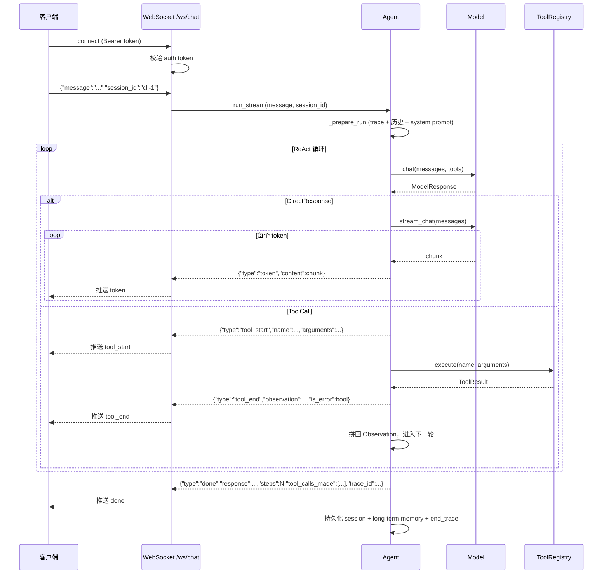

# 架构设计

本页描述 Open Agent 的整体架构、核心模块、请求生命周期与扩展点。理解这些内容后，你就能准确地扩展工具、模型或前端。

## 设计原则

Open Agent 遵循三条核心设计原则：

1. **"one core library, many frontends"** — 所有智能都集中在 `src/open_agent/agent/` 这个纯 Python 库中。CLI、FastAPI 服务、Web UI、VS Code 扩展都只是它的薄壳，可以独立替换或新增。
2. **Agent Core 纯 Python** — Agent 核心不依赖 FastAPI、React 或 VS Code API，可被嵌入任何 Python 进程（脚本、Notebook、定时任务、桌面应用）。
3. **API Gateway 是薄适配层** — `server/api.py` 只负责把 HTTP/WebSocket 请求翻译成对 `Agent` 的调用，不含任何业务逻辑；所有重构建、错误处理、Tracer 串联都在核心层完成。

这三条原则共同保证了：核心可被任意前端复用，前端可被任意替换，而新增一种交付形态（如移动端、Slack Bot）只需写一层适配。

## 整体架构

```text
┌─────────────────┐  ┌─────────────────┐  ┌─────────────────┐
│   CLI Frontend  │  │   Web Frontend  │  │  VS Code Plugin │
│   (Python/Rich) │  │  (React + Vite) │  │   (TypeScript)  │
└────────┬────────┘  └────────┬────────┘  └────────┬────────┘
         │                    │                    │
         └────────────────────┼────────────────────┘
                              │ HTTP / stdio
         ┌────────────────────┴────────────────────┐
         │          API Gateway (FastAPI)          │
         │         (适配层，不含业务逻辑)           │
         └────────────────────┬────────────────────┘
                              │
         ┌────────────────────┴────────────────────┐
         │           Agent Core (Python)           │
         │  ┌─────────┐ ┌─────────┐ ┌─────────┐  │
         │  │ Planner │ │  RAG    │ │ Tool    │  │
         │  │ (ReAct) │ │ (Vector)│ │ Registry│  │
         │  └─────────┘ └─────────┘ └─────────┘  │
         │  ┌─────────┐ ┌─────────┐ ┌─────────┐  │
         │  │ Memory  │ │ Model   │ │ MCP     │  │
         │  │ (Short/ │ │ (Multi- │ │ Adapter │  │
         │  │  Long)  │ │provider)│ │         │  │
         │  └─────────┘ └─────────┘ └─────────┘  │
         └─────────────────────────────────────────┘
```

## 核心模块

### Agent Core

`src/open_agent/agent/core.py` 中的 `Agent` 类是整个系统的枢纽。它编排一次推理的全部参与者：

- `model: ModelInterface` — 语言模型
- `tool_registry: ToolRegistry` — 工具目录
- `memory: ShortTermMemory` — 短期滑动窗口记忆
- `session_manager: SessionManager` — 会话持久化（可选）
- `long_term_memory: LongTermMemory` — 向量长期记忆（可选）
- `tracer: Tracer` — 可观测后端
- `planner: Planner` — 解析模型输出
- `executor: ToolExecutor` — 调度工具执行

`Agent.run()` 实现 ReAct 主循环；`Agent.run_stream()` 在此基础上把最终回答以 token 流式输出。两者共用一个 `_run_lock`，串行化对同一 `Agent` 实例的并发调用（因为 `memory` 与 `session_manager` 不是并发安全的）。

### Planner（ReAct）

`src/open_agent/agent/planner.py` 的 `Planner.parse(response)` 决定一次模型输出是「直接回答」还是「工具调用」。优先级：

1. **结构化 `tool_calls`**（首选）— 模型 provider 原生返回的 `ToolCall` 列表，取第一个。
2. **文本中嵌入的 JSON 工具块**（兜底）— 解析 ` ```json ... ``` ` 围栏或裸 JSON 对象，提取 `{"name": ..., "arguments": ...}`。
3. **纯文本回答** — 上述都不匹配时，把 `content` 当作 `DirectResponse`。

```text
ParsedPlan = DirectResponse | ToolCall
```

!!! note "为什么只取第一个工具调用"
    当前实现一次只执行一个工具调用，剩余的仍可通过 `ModelResponse.tool_calls` 访问。这简化了观察回流与 Trace 的对齐，也避免并行工具带来的状态竞争。

### RAG

`src/open_agent/rag/` 提供文档加载、切块、向量化、混合检索、重排序与知识库路由的完整链路。核心组件：

- `KBManager` — 高层管理器，对外暴露 `index_file / index_directory / query / list_kbs`。
- `KnowledgeBase` + `KnowledgeBaseRouter` — 多知识库语义路由。
- `Indexer` — 按 `chunk_size` / `chunk_overlap` 切块（`char` 或 `paragraph` 单位）。
- `FAISSStore` / `ChromaStore` — 向量存储后端。
- `HybridRetriever` — 向量检索 + BM25 关键词检索，RRF 融合。
- `reranker` — 交叉编码器重排序（默认 `BAAI/bge-reranker-v2-m3`）。

详见 [RAG 知识库](rag.md)。

### Tool Registry

`src/open_agent/tools/registry.py` 的 `ToolRegistry` 用名字索引 `Tool` 实例，提供：

- `register(tool)` — 注册（同名覆盖）。
- `get(name)` — 按名查找。
- `list_tools()` — 列出所有名字。
- `schemas()` — 输出 JSON Schema 列表给模型 function-calling。
- `execute(name, **kwargs)` — 执行工具，**异常被捕获并转换为 `ToolResult(success=False)`**，单个工具失败不会让 Agent 循环崩溃。

详见 [工具系统](tools.md)。

### Memory

- **短期记忆** `ShortTermMemory` — 滑动窗口，保留最近 `OPEN_AGENT_SHORT_TERM_MEMORY_SIZE`（默认 20）条消息。
- **会话管理** `SessionManager` — 按 `session_id` 持久化到 `OPEN_AGENT_SESSION_STORAGE_DIR`（JSON 文件），支持历史查询、清空、重命名、搜索、导出。
- **长期记忆** `LongTermMemory` — 向量后端（基于 `sentence-transformers`），跨会话召回。每次对话结束时会调用 `add_exchange` 记录用户输入与回答，下次对话前用 `_recall_long_term_memory` 检索相关片段注入上下文。

### Model Interface

`src/open_agent/models/base.py` 定义了统一的 `ModelInterface` 抽象：

```python
class ModelInterface(ABC):
    async def chat(messages, tools=None) -> ModelResponse: ...
    async def stream_chat(messages, tools=None) -> AsyncIterator[str]: ...
```

四个内置实现：

| Provider 类 | `OPEN_AGENT_MODEL_PROVIDER` | 说明 |
|---|---|---|
| `OpenAIModel` | `openai` | OpenAI 及任何 OpenAI 兼容端点（智谱、DeepSeek、Together 等）。 |
| `AnthropicModel` | `anthropic` | Anthropic Claude。 |
| `OllamaModel` | `ollama` | 本地 Ollama，无需 API Key。 |

所有 provider 共享一个模块级 `httpx.AsyncClient` 做连接池，并在 `aclose()` 时统一释放。`LangChainAdapter` 把 `ModelInterface` 包装成 LangChain `Runnable`，供 `LangGraphAgent` 使用。

### MCP Adapter

`src/open_agent/mcp/` 让任意 MCP 服务器的工具成为 Agent 的一等公民：

- `load_mcp_servers(path)` — 从 JSON 文件加载服务器配置。
- `MCPClient` — 启动子进程、建立 stdio 会话、`list_tools` / `call_tool`。
- `adapt_mcp_tools(client)` — 把 MCP 工具包装成 `MCPToolAdapter(Tool)`，注册进 `ToolRegistry`。

工具名命名空间为 `server_name/tool_name`，避免与内置工具或其他 MCP 服务器冲突。

### Observability

`src/open_agent/observability/tracer.py` 提供统一 `Tracer` 接口与三种实现：

- `NoOpTracer` — 不做任何持久化，仅维护内存结构。
- `LocalJsonlTracer` — 把每个 trace 以一行 JSON 写入 `traces.jsonl`。
- `LangSmithTracer` / `LangfuseTracer` — 转发到对应平台。

`Agent` 在每次 `run` / `run_stream` 中自动开启 trace、为每步 LLM 调用与工具调用开启 span，并在结束时写入。详见 [可观测性](observability.md)。

## 数据流

一次用户请求的端到端数据流：

```text
用户输入
   │
   ▼
API Gateway (FastAPI)        ── 校验 session_id、auth token
   │
   ▼
Agent.run(user_input, session_id)
   │
   ├─► _prepare_run
   │     ├─ 启动 trace + 根 span
   │     ├─ 加载 session 历史（或短期记忆）
   │     ├─ _recall_long_term_memory （可选）
   │     └─ 组装 system prompt + 历史 + 用户消息
   │
   └─► ReAct 循环（最多 max_steps 次）
         │
         ├─► _apply_context_window  （截断到 max_context_tokens）
         ├─► _llm_step
         │     ├─ model.chat(messages, tools=schemas)
         │     ├─ 开启 llm span，记录 latency_ms
         │     └─ Planner.parse(response)
         │
         ├─► 若 DirectResponse ──► 流式输出 token，结束
         │
         └─► 若 ToolCall
               ├─► 开启 tool span
               ├─► ToolExecutor.execute(name, arguments)
               ├─► 把 Observation 拼回 messages
               └─► 进入下一轮
   │
   ▼
AgentOutput(response, steps, tool_calls_made, trace_id)
   │
   ▼
持久化（session / long-term memory）+ 结束 trace
```

!!! info "步数耗尽的处理"
    当达到 `max_steps` 仍未得到 `DirectResponse`，Agent 会追加一句 "Maximum steps reached. Provide your best final answer now." 再请求一次模型，产出最终摘要，避免无响应。

## 请求生命周期

下面的时序图展示了一次 WebSocket 流式对话的完整生命周期（REST `/api/chat` 是其简化版，无 token 流）：



## 扩展点

### 添加新工具

继承 `Tool` 基类，设置 `name` / `description` / `parameters`，实现 `async execute(**kwargs) -> str`，然后 `registry.register(MyTool())`。详见 [工具系统 § 自定义工具](tools.md#自定义工具开发)。

### 添加新模型 Provider

实现 `ModelInterface` 的 `chat` 与 `stream_chat` 两个方法，然后在 `_build_agent`（`server/api.py`）和 `_build_agent`（`cli.py`）中按 `settings.model_provider` 分支实例化即可。建议复用 `_http.py` 的共享 `httpx.AsyncClient` 与重试逻辑。

### 添加新前端

API Gateway 已经把所有能力以 REST + WebSocket 暴露。新增前端只需：

1. 实现一个能与 `/api/chat` 或 `/ws/chat` 通信的客户端。
2. （可选）调用 `/api/settings` 让用户在 UI 内切换模型 / RAG 参数。
3. 调用 `/api/upload` 索引文档、`/api/sessions/*` 管理会话。

参考 `web/`（React + Vite）与 `vscode-extension/`（TypeScript）两种现有实现。

## 下一步

- [工具系统](tools.md) — 内置工具与自定义工具开发。
- [RAG 知识库](rag.md) — 检索链路与知识库路由。
- [API 参考](api.md) — REST/WebSocket 端点详解。
- [配置参考](configuration.md) — 环境变量与运行时更新。
